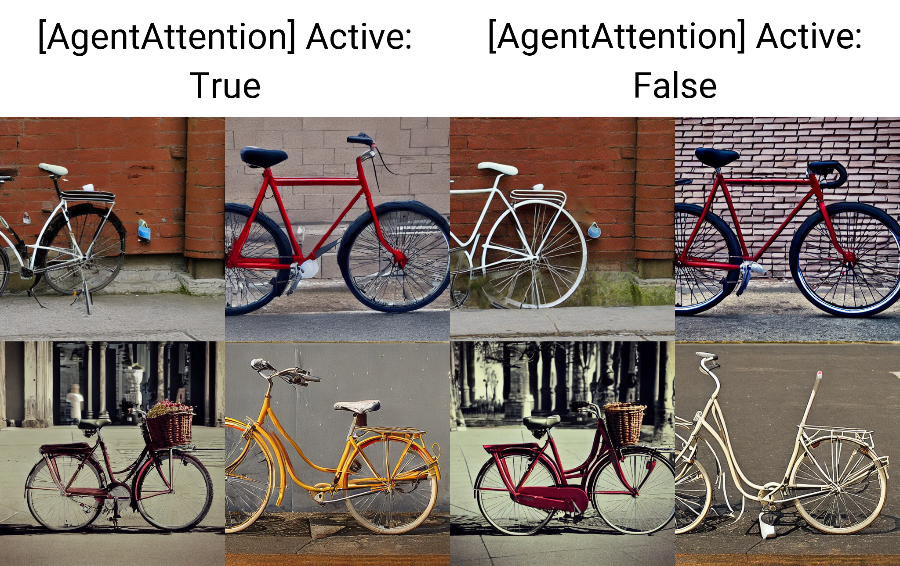
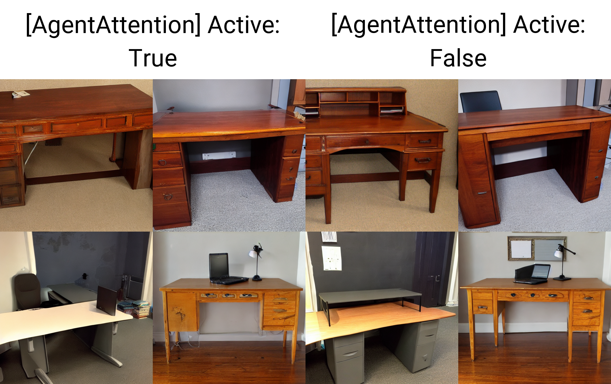

# sd-webui-agentattention
### An unofficial implementation of Agent Attention in Automatic1111 WebUI.
This extension uses code from the official AgentAttention repository: https://github.com/LeapLabTHU/Agent-Attention



### Issues / Pull Requests are welcome!

### Credits
- The authors of the original paper for their method (https://arxiv.org/abs/2312.08874):
	```
	@misc{han2023agent,
      title={Agent Attention: On the Integration of Softmax and Linear Attention}, 
      author={Dongchen Han and Tianzhu Ye and Yizeng Han and Zhuofan Xia and Shiji Song and Gao Huang},
      year={2023},
      eprint={2312.08874},
      archivePrefix={arXiv},
      primaryClass={cs.CV}
	}
	```
- Official code for Agent-Attention: https://github.com/LeapLabTHU/Agent-Attention
- @udon-universe's extension templates (https://github.com/udon-universe/stable-diffusion-webui-extension-templates)

### More samples 




